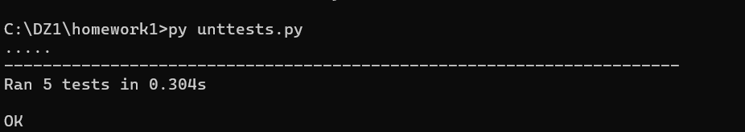
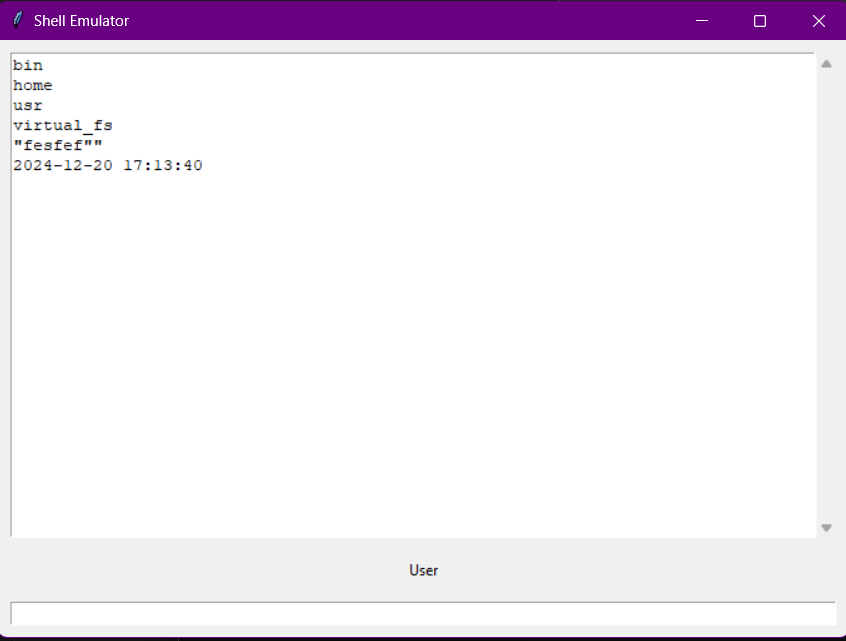

# 1. Клонирование репозитория

Склонируйте репозиторий с исходным кодом и тестами:

```
git clone <URL репозитория>
cd <директория проекта>
```

# 2. Установка зависимостей при запуске

```
pip install tkinter
pip install tarfile
pip install argparse

```

# Создайте виртуальное окружение

```bash
# Активируйте виртуальное окружение
python -m venv venv
# Для Windows:
venv\Scripts\activate
# Для MacOS/Linux:
source venv/bin/activate
```


# 3. Структура проекта
Проект содержит следующие файлы и директории:
```bash
unittests.py              # файл для тестирования
virtual_fs.zip           # zip-архив в качестве образа файловой системы
emulator.py                  # файл с программой
```

# 4. Запуск проекта
```bash
py emulator.py --hostname User virtual_fs.zip     # py название файла --hostname <имя> <файл с образом файловой системы>
```

