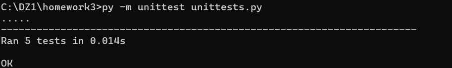
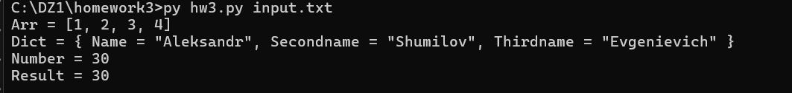

# Установка
1. Установка программы и переход в директорию
   ```bash
   git clone <URL репозитория>
   cd <директория проекта>
   ```
2. Создайте и активируйте виртуальное окружение:
   ```bash
   python3 -m venv venv
   source venv/bin/activate  # Для Linux/Mac
   venv\Scripts\activate     # Для Windows
   ```
3. Установите необходимые зависимости :
   ```bash
   Зависимости не требуются
   ```

# Запуск скрипта

Скрипт принимает текст конфигурационного файла через стандартный ввод и выводит xml в стандартный вывод.

```bash
py hw3.py input.txt
```


# Тесты

Шаги запуска тестов:
1. Установить библиотеку pytest (необходимо, если не сделано ранее):
   ```bash
   pip install pytest
   ```
   
2. Для запуска тестирования необходимо запустить следующий скрипт:
   ```shell
   py -m unittest unittests.py
   ```

